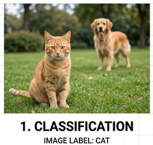
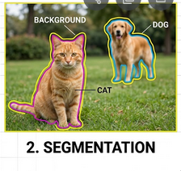

```{=html}
<table>
  <thead>
    <tr>
      <th>Technical level</th>
      <th>Tasks</th>
    </tr>
  </thead>
  <tbody>
    <tr>
      <td><span class="level-button level-beginner">Beginner</span></td>
      <td>Doing the exercises of steps 1, 3 and 4, relying on clues and solutions if needed.</td>
    </tr>
    <tr>
      <td><span class="level-button level-intermediate">Intermediate</span></td>
      <td>Doing the exercises of steps 1 to 4 </td>
    </tr>
    <tr>
      <td><span class="level-button level-expert">Expert</span></td>
      <td>Doing the exercises of steps 1 to 4, without relying on clues and solutions</td>
    </tr>
  </tbody>
</table>
```

## Introduction {.unnumbered}

Satellite imagery is one of the richest data sources available for understanding how land is used and how it changes over time. With this project, you will work with **Sentinel-2** multispectral images from the European Copernicus programme and use a **deep learning model (SegFormer)** to perform **semantic segmentation** : classifying every pixel in an image into a land-cover category.

## Machine learning in 90 seconds

If you haven't worked with machine learning before, here is the whole idea of this project in one paragraph.

**Supervised learning** means showing a model many *(input, correct-answer)* pairs and letting it figure out the mapping between them on its own. Once trained, we feed it a brand-new input and it predicts the answer. In this project, the inputs are Sentinel-2 satellite tiles and the answers are land-cover maps from [**CLC+ Backbone**](https://land.copernicus.eu/en/products/clc-backbone), a high-resolution land-cover product produced by the Copernicus Land Monitoring Service covering the whole of Europe.

```{mermaid}
%%| eval: true
flowchart LR
    A["🛰️ Images"] --> M
    B["🗺️ Labels"] --> M
    M["Model(SegFormer)"] -->|learns from pairs| T["Trainedmodel"]
    N["🛰️ New image"] --> T
    T --> P["🗺️ Predicted label"]
```

**Classification vs. semantic segmentation.** Most introductory ML examples deal with *classification* — one label for a whole image (*"this is a cat"*). Land-cover mapping needs something finer: **semantic segmentation**, where the model assigns a class to *every pixel*, producing a colored mask the same shape as the input. We don't just want to know *"there is forest in this tile"* — we want to know exactly **which pixels** are forest, which are water, and which are buildings.

::: {layout-ncol=2}



:::

## What you will learn

By completing this project you will learn to:

- Download and manipulate satellite imagery and land-cover labels
- *(Optional)* Use CDSE interfaces to fetch Sentinel2 images
- Understand the structure of multispectral raster data (bands, CRS, bounding boxes)
- Manipulate geodata and associate it to maps
- Run inference with a pre-trained SegFormer model to produce land-cover maps
- Compute regional statistics (area by class, artificialization rates) using administrative boundaries
- *(Optional)* Train a segmentation model from scratch and track experiments with MLflow

# Structure of the project

This project has five sections (listed in the banner at the top of the page):

1. **Data Acquisition & Manipulation** — Download Sentinel-2 images and CLC+ labels, visualise and manipulate raster data.
2. **Model Explanation** — Understand the SegFormer architecture, inspect its parameters, and trace a forward pass.
3. **Model Training** *(optional)* — Train the model yourself, configure callbacks, and track experiments with MLflow.
4. **Inference** — Use a pre-trained model checkpoint to produce land-cover maps.
5. **Statistics** — Compute regional statistics from the predictions using administrative boundaries.

# Initialization of the project

Create a [Vscode-python](https://datalab.sspcloud.fr/launcher/ide/vscode-python) service on SSP Cloud.

In the service, open a terminal by clicking on , then `Terminal > New Terminal`. Clone the project repository with:

```
git clone https://github.com/AIML4OS/funathon-project3.git
```

Structure of the project:

- The `.qmd` files and the `_quarto.yaml` file are necessary to build the website;
- The file `pyproject.toml` describes the dependencies of the project;
- The `starting_point/` folder contains exercise templates to complete.
- final solutions are available in the `final_solution/` folder.
:::


## Installation of dependencies

Install the project dependencies by running the following command in the terminal:

```
uv sync
```

If you want to work on the optional model-training section, install the training extras:

```
uv sync --extra training
```

## Working on the exercises

The exercise templates in `starting_point/` are Python files split into **cells** delimited by `# %%` comments. Each cell corresponds to one exercise from the tutorial pages.

To execute them interactively:

1. Open a `.py` file from `starting_point/` in VSCode
2. VSCode recognises `# %%` markers and displays a **"Run Cell"** button above each one
3. Click **Run Cell** (or press `Ctrl+Enter` / `Shift+Enter`) to execute a single cell in an interactive Python window
4. Write your solution code under the corresponding `# %%` header, then run the cell to test it

::: {.callout-tip}
The tutorial pages (`.qmd` files) contain the full exercise descriptions, hints, and solutions. Use them as reference while working in the `.py` files.
:::
